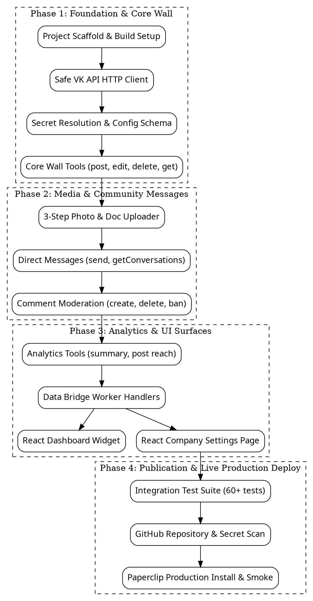

# Paperclip VK Community Tools Plugin Design

**Document:** `docs/superpowers/specs/2026-09-20-paperclip-vk-community-tools-design.md`  
**Status:** Approved by Operator  
**Target:** Separate standalone repository `@zaruba/paperclip-vk-community-tools`  
**Platform:** Paperclip Control Plane (V1 Plugin System, Plugin SDK `2026.916.0`)

---

## 1. Executive Summary

`paperclip-vk-community-tools` is an official Paperclip plugin providing deep bidirectional integration between Paperclip AI agent companies and VK communities (public groups/pages).

The plugin addresses three core requirements:
1. **Operator Connector Surface:** Appears in Paperclip under `Settings -> Plugins` and mounts a dedicated company-scoped settings view (`companySettingsPage`) for configuring community binding and reviewing connection status.
2. **Dashboard Overview:** Mounts a real-time `dashboardWidget` on the company dashboard showing community identity, subscriber counts, weekly growth, reach, unread/unanswered messages, and token validity.
3. **Autonomous Agent Tooling:** Exposes 23 high-level tools covering the complete lifecycle of group management: wall publishing, media uploads, community messaging, comment moderation, and engagement analytics.

---

## 2. Authentication & Token Architecture

VK API distinguishes privileges based on token type. No single token covers both public wall publishing and community messaging safely:

| Scope / Action | Token Required | Minimum Permissions | Reason |
|---|---|---|---|
| Wall publishing & editing (`wall.post`, `wall.edit`) | **User Token** | `wall`, `photos`, `docs`, `offline` | Standalone app user token with admin access to group. Group tokens cannot publish posts on behalf of group in all VK modes. |
| Media upload to wall | **User Token** | `photos`, `docs`, `video`, `offline` | VK upload servers for wall media require user access rights. |
| Group messages (`messages.send`, `messages.getHistory`) | **Group Token** | `messages`, `photos`, `docs` | Community token issued in Group Settings -> Manage -> API Keys. Users cannot send messages on behalf of community. |
| Group comments & moderation | **Group or User Token** | `wall`, `groups` | Preferred: Group token (clean audit log as group). |
| Extended community statistics (`stats.get`) | **User Token** | `stats`, `groups` | Complete demographics and city reach require group admin user rights. |

### 2.1 Storage & Secret Safety
- Cleartext tokens **never** appear in manifest settings, database configuration, activity logs, or agent tool outputs.
- Configuration accepts Paperclip secret references:
  - `userTokenRef`: `{ type: "secret_ref", secretId: string, version?: "latest" | number }`
  - `groupTokenRef`: `{ type: "secret_ref", secretId: string, version?: "latest" | number }`
- At runtime, the plugin resolves secrets via `ctx.secrets.resolve()` only in-memory inside the worker process, immediately before issuing HTTPS requests to `https://api.vk.com/method/`.
- All exceptions, stack traces, and error payloads sanitize strings matching VK token signatures (`vk1.a...`).

---

## 3. Manifest Declaration & Capabilities

```json
{
  "id": "zaruba.vk-community-tools",
  "apiVersion": 1,
  "version": "0.1.0",
  "displayName": "VK Community Tools",
  "description": "Complete VK group integration: wall publishing, media, messages, comments, analytics, connector page, and dashboard widget.",
  "author": "Openser",
  "categories": ["connector", "ui", "automation"],
  "capabilities": [
    "agent.tools.register",
    "http.outbound",
    "secrets.read-ref",
    "instance.settings.register",
    "ui.dashboardWidget.register"
  ],
  "entrypoints": {
    "worker": "./dist/worker.js",
    "ui": "./dist/ui"
  }
}
```

### 3.1 Instance / Company Configuration Schema

```json
{
  "type": "object",
  "additionalProperties": false,
  "required": ["groupId", "userTokenRef", "groupTokenRef"],
  "properties": {
    "groupId": {
      "type": "integer",
      "minimum": 1,
      "title": "VK Group ID",
      "description": "Numeric ID of the VK community without minus sign (e.g. 229871234)"
    },
    "userTokenRef": {
      "title": "VK User Access Token (Secret Reference)",
      "format": "secret-ref",
      "oneOf": [
        { "type": "string", "minLength": 1 },
        {
          "type": "object",
          "required": ["type", "secretId"],
          "properties": {
            "type": { "type": "string", "const": "secret_ref" },
            "secretId": { "type": "string", "minLength": 1 },
            "version": { "oneOf": [{ "type": "string", "const": "latest" }, { "type": "integer", "minimum": 1 }] }
          }
        }
      ]
    },
    "groupTokenRef": {
      "title": "VK Group Access Token (Secret Reference)",
      "format": "secret-ref",
      "oneOf": [
        { "type": "string", "minLength": 1 },
        {
          "type": "object",
          "required": ["type", "secretId"],
          "properties": {
            "type": { "type": "string", "const": "secret_ref" },
            "secretId": { "type": "string", "minLength": 1 },
            "version": { "oneOf": [{ "type": "string", "const": "latest" }, { "type": "integer", "minimum": 1 }] }
          }
        }
      ]
    },
    "apiVersion": {
      "type": "string",
      "default": "5.199",
      "title": "VK API Version"
    },
    "rateLimitRps": {
      "type": "integer",
      "minimum": 1,
      "maximum": 20,
      "default": 3,
      "title": "Max Requests Per Second"
    }
  }
}
```

---

## 4. UI Surfaces

### 4.1 Company Settings Page Slot (`companySettingsPage`)
- **Location in the current Paperclip build:** the plugin appears in `Settings -> Plugins` with category `connector` and mounts a dedicated `VK Community` entry in company settings through `companySettingsPage`.
- **Connector registry boundary:** the inspected Paperclip build has no independent generic `Connectors` registry API or route. Therefore the plugin must not patch Paperclip core merely to create such a section. If a first-class connector registry is added upstream, a later plugin version may declare that contract without changing the worker/tool architecture.
- **Functionality:**
  - Visual status pill: `Connected` / `Misconfigured` / `Invalid Tokens`.
  - Group Header: Photo, verified badge, community name, screen name, member count.
  - Token health diagnostics:
    - User Token: Status, expiration indicator, scopes confirmed (`wall`, `photos`, `docs`, `offline`).
    - Group Token: Status, scopes confirmed (`messages`, `photos`, `docs`).
  - Deep-link to Paperclip Secrets Vault to update/rotate tokens.
  - Button `Test Connection` invoking worker Data Bridge action.

### 4.2 Dashboard Widget Slot (`dashboardWidget`)
- **Location:** Paperclip Company Overview Dashboard.
- **Visual Presentation:**
  - Card with VK branded accent.
  - Header: Community avatar + name + status indicator.
  - Metrics Grid (2x2):
    - **Members:** Total subscribers + 7-day net change (`+N`).
    - **7-day Reach:** Total impressions & viral split.
    - **Inbox:** Unanswered conversations requiring attention.
    - **Wall:** Timestamp of latest published post.
  - Footer Action: Quick link to open VK community in new tab and button to trigger status refresh.

---

## 5. Autonomous Agent Tool Catalog (18 Tools)

All tools require an active `ToolRunContext` containing authorized `companyId`. Settings are resolved dynamically per-company via `ctx.config.get(runCtx.companyId)`.

### 5.1 Community Identity & Membership
1. `vk_group_get_details`: Reads community name, description, status, photo, cover, member count, website, and enabled features.
2. `vk_group_is_member`: Checks whether a given VK user (`userId`) is a member or subscriber of the group.

### 5.2 Wall Publishing & Lifecycle
3. `vk_wall_post`: Publishes a new post to the community wall from the community name.
   - Parameters: `message` (text, max 16KB), `attachments` (array of formatted strings like `photo-XXXX_YYYY`), `publishDate` (optional unix timestamp for scheduled posts), `muteNotifications` (boolean), `closeComments` (boolean).
4. `vk_wall_edit`: Modifies an existing published or postponed post.
   - Parameters: `postId`, `message`, `attachments`, `publishDate`.
5. `vk_wall_delete`: Deletes a post from the community wall.
   - Parameters: `postId`.
6. `vk_wall_get`: Retrieves a paginated list of posts from the wall.
   - Parameters: `filter` (`"owner" | "postponed" | "suggested"`), `count` (1..100), `offset`.
7. `vk_wall_pin`: Pins a post to the top of the community wall.
   - Parameters: `postId`.
8. `vk_wall_unpin`: Unpins a post.
   - Parameters: `postId`.

### 5.3 Media Uploads
9. `vk_media_upload_photo`: Implements the 3-step VK photo upload protocol.
   - Protocol: `photos.getWallUploadServer` -> multipart upload -> `photos.saveWallPhoto`.
   - Accepts either a public image URL or local workspace path.
   - Returns attachment descriptor: `photo{owner_id}_{id}` ready for `vk_wall_post`.
10. `vk_media_upload_document`: Uploads a document/file for wall attachment (`docs.getWallUploadServer` -> upload -> `docs.save`).
    - Returns attachment descriptor: `doc{owner_id}_{id}`.
11. `vk_media_upload_video`: Initiates direct video upload to the community (`video.save`).
    - Parameters: `name`, `description`, `isPrivate`, `wallpost`.
    - Returns upload URL and final video descriptor `video{owner_id}_{id}`.
12. `vk_media_create_poll`: Creates a public or anonymous poll (`polls.create`) for attachment to a wall post.
    - Parameters: `question`, `answers` (2..10 strings), `isAnonymous`, `isMultiple`.

### 5.4 Comments & Moderation
13. `vk_comments_get`: Retrieves comments for a specific post, including threaded replies.
    - Parameters: `postId`, `count` (1..100), `offset`, `sort` (`"asc" | "desc"`).
14. `vk_comments_create`: Posts a comment on behalf of the community in response to a post or user comment.
    - Parameters: `postId`, `message`, `replyToCommentId` (optional), `attachments` (optional).
15. `vk_comments_delete`: Deletes an offending comment from the wall.
    - Parameters: `commentId`.
16. `vk_members_ban`: Adds a user to the community blacklist.
    - Parameters: `userId`, `endDate` (unix timestamp or 0 for permanent), `reason` (spam, abuse, etc.), `comment`.
17. `vk_members_unban`: Removes a user from the community blacklist.
    - Parameters: `userId`.

### 5.5 Community Direct Messages
18. `vk_messages_get_conversations`: Retrieves conversations sent to the group inbox.
    - Parameters: `filter` (`"all" | "unread" | "unanswered" | "important"`), `count` (1..50).
19. `vk_messages_get_history`: Reads full conversation history with a specific peer.
    - Parameters: `peerId`, `count` (1..100), `offset`.
20. `vk_messages_send`: Sends a direct message to a user from the community.
    - Parameters: `peerId` (user ID), `message`, `randomId` (auto-generated int32 for idempotency), `attachments` (optional).
21. `vk_messages_mark_as_read`: Clears the unread badge for a given conversation.
    - Parameters: `peerId`.

### 5.6 Analytics & Performance
22. `vk_stats_get_summary`: Retrieves aggregated community stats for a date range.
    - Parameters: `timestampFrom`, `timestampTo`, `intervalsCount` (days).
    - Returns: Visitors, views, reach (viral vs subscribers), age/gender breakdown, top cities.
23. `vk_stats_get_post_reach`: Retrieves detailed metrics for up to 300 wall posts (`stats.getPostReach`).
    - Parameters: `postIds` (array of integers).
    - Returns: Reach total, reach subscribers, reach viral, link clicks, carousel clicks, hides, joins.

---

## 6. Implementation Phasing



---

## 7. Verification & Acceptance Criteria

1. **Static Analysis & Typecheck:**
   - 100% clean `tsc --noEmit` across worker and UI codebases.
   - Dual-bundle verification (`dist/worker.js` and `dist/ui/index.js`).
2. **Automated Unit & Integration Tests:**
   - Client tests verifying exponential backoff on VK error `6` (Too many requests per second) and token sanitization on error `5` (User authorization failed).
   - SSRF and upload URL safety verification (ensuring media uploads only target trusted `*.vk.com` and `*.vk.ru` upload servers).
   - Harness tests verifying all 20 tools using `@paperclipai/plugin-sdk/testing`.
3. **Live Upstream Validation:**
   - Live smoke test verifying community lookup and test post creation with real group ID.
   - Live verification of the `dashboardWidget` rendering inside Paperclip UI.
4. **Security Clearance:**
   - Clean `git log -p --all` secret scan before any push to GitHub.
   - Zero plaintext token persistence in database or manifest.
